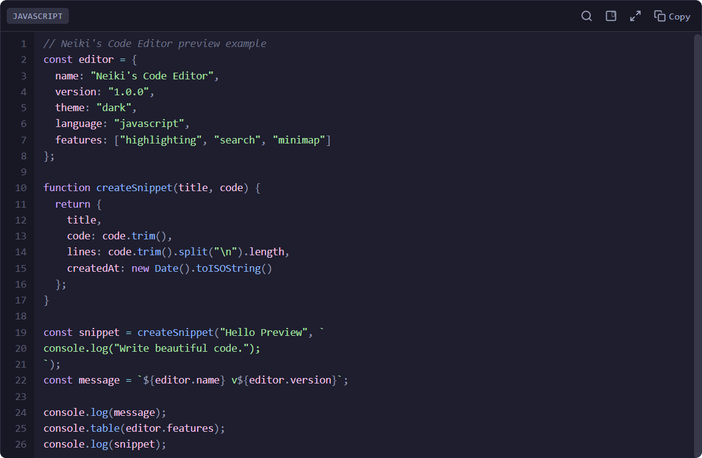

<p align="center">
  
</p>

<h1 align="center">Neiki's Code Editor</h1>

<p align="center">
  
  
  
  
  <br>
  
  
</p>

<p align="center">
  <b>Lightweight Embeddable Code Editor</b><br>
  <i>Vanilla JavaScript Web Component with syntax highlighting, themes, search, line numbers, minimap and fullscreen mode.</i>
</p>

<p align="center">
  
  
  
  
</p>

<p align="center">
  <a href="https://sourceforge.net/projects/neiki-code-editor/files/latest/download"></a>
</p>


---



---

**Live version:** [https://neikiri.dev/code-editor](https://neikiri.dev/code-editor)

---

## ✨ Features

- **Vanilla JavaScript only** — no frameworks, packages, bundlers or build tools.
- **Web Components API** — works as a native custom element.
- **Shadow DOM** — isolated styling with no global CSS leakage.
- **Syntax highlighting** — supports JavaScript, HTML, CSS, JSON and Markdown.
- **Editable code area** — smooth typing experience with polished cursor behavior.
- **Line numbers** — optional line numbering with active line indication.
- **Themes** — built-in dark and light themes inspired by modern developer tools.
- **Keyboard friendly** — tab support, auto indentation and common shortcuts.
- **Auto closing brackets** — supports `()`, `{}`, `[]`, `""` and `''`.
- **Search** — basic in-editor search with keyboard navigation.
- **Copy button** — quickly copy the current editor content.
- **Readonly mode** — useful for documentation, examples and snippets.
- **Responsive layout** — works well on desktop and mobile browsers.
- **Minimap support** — optional visual overview for longer snippets.
- **Fullscreen mode** — optional distraction-free editing.

---

## 🚀 Quick Start

Recommended CDN installation:

```html
<script src="https://cdn.neikiri.dev/neiki-code-editor/neiki-code-editor.min.js"></script>
```

This is the recommended production build. It includes the minified JavaScript and the minified default CSS inside a single file.

You can also use the readable CDN build:

```html
<script src="https://cdn.neikiri.dev/neiki-code-editor/neiki-code-editor.js"></script>
```

If you want easier theme customization, you can optionally load the external CSS file too:

```html
<link rel="stylesheet" href="https://cdn.neikiri.dev/neiki-code-editor/neiki-code-editor.css">
<script src="https://cdn.neikiri.dev/neiki-code-editor/neiki-code-editor.js"></script>
```

Or use a local copy:

```html
<script src="neiki-code-editor.js"></script>
```

Use the custom element directly in your markup:

```html
<neiki-code-editor language="javascript" theme="dark">
console.log("Hello world");
</neiki-code-editor>
```

The component is registered automatically when the script loads.

---

## 🎨 Optional Custom Styling

The editor includes default styles automatically. You can also load the optional stylesheet to make customization easier:

```html
<link rel="stylesheet" href="neiki-code-editor.css">
<script src="neiki-code-editor.js"></script>
```

You can customize the editor with CSS custom properties:

```css
neiki-code-editor {
  --nce-bg: #282c34;
  --nce-fg: #abb2bf;
  --nce-keyword: #c678dd;
  --nce-string: #98c379;
  font-size: 15px;
}
```

---

## 🧩 Component API

### Attributes

| Attribute | Description |
| --- | --- |
| `language` | Sets syntax highlighting language: `javascript`, `html`, `css`, `json`, `markdown`. |
| `theme` | Sets the theme: `dark` or `light`. |
| `readonly` | Makes the editor non-editable. |
| `line-numbers` | Controls line numbers. Use `false` to hide them. |
| `minimap` | Enables the optional minimap. |
| `fullscreen` | Enables fullscreen display. |

### Methods

| Method | Description |
| --- | --- |
| `getValue()` | Returns the current editor value. |
| `setValue(value)` | Replaces the current editor value. |
| `focus()` | Focuses the editor. |
| `format()` | Formats supported content, currently JSON. |

### Events

| Event | Description |
| --- | --- |
| `change` | Fired when the editor value changes. Includes `event.detail.value`. |
| `focus` | Fired when the editor receives focus. |
| `blur` | Fired when the editor loses focus. |

---

## 🌐 Global API

Neiki's Code Editor exposes a small global API:

```js
window.NeikiCodeEditor
```

Programmatic creation example:

```js
const editor = window.NeikiCodeEditor.create(document.body, {
  language: 'javascript',
  theme: 'dark',
  value: 'console.log("Hello world");'
});

console.log(editor.getValue());
```

Accessing an existing editor:

```js
const editor = document.querySelector('neiki-code-editor');
editor.setValue('const message = "Updated";');
editor.focus();
```

---

## 💡 Usage Examples

### JavaScript

```html
<neiki-code-editor language="javascript" theme="dark">
function greet(name) {
  return `Hello, ${name}!`;
}
</neiki-code-editor>
```

### JSON

```html
<neiki-code-editor language="json" theme="dark">
{"name":"Neiki's Code Editor","version":"1.0.0"}
</neiki-code-editor>
```

### Readonly snippet

```html
<neiki-code-editor language="css" theme="light" readonly>
.button {
  border-radius: 8px;
  padding: 0.75rem 1rem;
}
</neiki-code-editor>
```

---

## ♿ Accessibility & UX

- **Native textarea input** keeps editing predictable and keyboard friendly.
- **Accessible contrast** is used in both built-in themes.
- **No iframe or canvas editing** keeps text selectable, searchable and copyable.
- **Mobile scrolling** is optimized with touch-friendly overflow behavior.
- **Shadow DOM isolation** prevents style conflicts with host pages.

---

## 🔒 Security Notes

Neiki's Code Editor is a client-side component. It does not use `eval`, does not execute edited code and does not require a backend. Highlighted output is generated with escaped user content to reduce XSS risk.

---

## 📄 License

This project is licensed under the **MIT License** — see the [LICENSE](LICENSE) file for details.

---

## 👨‍💻 Author

**neikiri**
GitHub: https://github.com/neikiri

---

## 📬 Contact

📧 Email: neikiri@neikiri.dev
